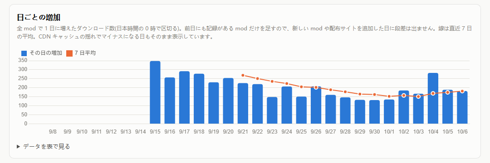
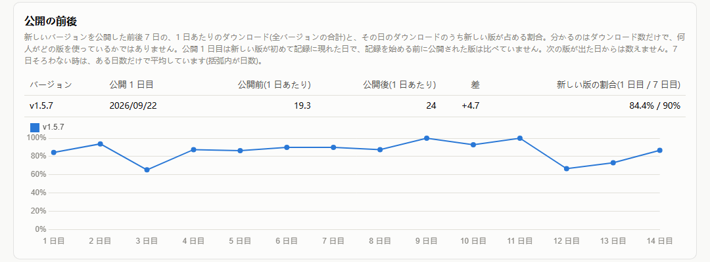
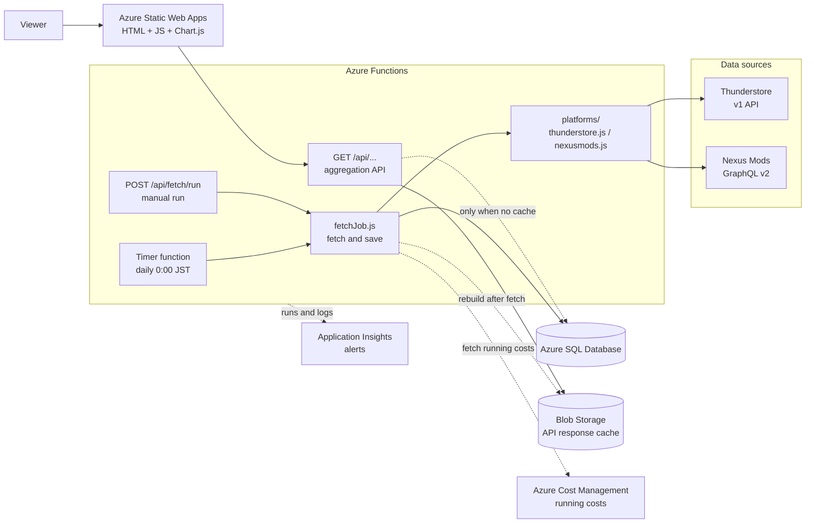

[日本語](README.md)

# Mod Insight

A data analysis dashboard that **collects download counts, ratings and versions of published mods (add-on programs for games) from two distribution sites every day**,
keeps them as history, and charts how they grow.

- Dashboard: **https://www.ryuka.cloud**
- What it tracks: mods the author has published on Thunderstore and Nexus Mods (25 on each, 50 in total). The data is real, with real users behind it
- Stack: Azure Functions (fetch job + REST API) / Azure SQL Database / Azure Static Web Apps / Application Insights

The system is a pipeline of "fetch → store as time series → aggregation API → visualization" on top of the distribution sites' APIs.
You could swap the target for products on an e-commerce site, apps on the App Store, or anything else whose numbers are available through an API, and keep the same design.


---

## Contents

1. [What the dashboard shows](#1-what-the-dashboard-shows)
2. [Current data](#2-current-data-as-of-2026-10-07)
3. [Decisions on data handling](#3-decisions-on-data-handling)
4. [Architecture](#4-architecture)
5. [Database](#5-database)
6. [REST API](#6-rest-api)
7. [Monitoring](#7-monitoring)
8. [Directory layout](#8-directory-layout)
9. [Running locally and deploying](#9-running-locally-and-deploying)
10. [Known limitations and next steps](#10-known-limitations-and-next-steps)

---

## 1. What the dashboard shows

The dashboard UI is in Japanese. Below, UI labels are given in English with the original in parentheses.

Pick a **platform** (配布サイト) and a **period** (期間: 7 days / 30 days / 90 days / all) at the top of the page. Both the all-mods view and the mod detail view are aggregated with that selection.
Choose which mod to inspect with the **Mod** selector next to the detail heading (clicking a row in the table also switches it).
The **Operations** section (運用状況) at the bottom of the page shows running costs and fetch job runs. It records the system as a whole, so no selection applies to it.

| Question | Where to look | How it is calculated |
|---|---|---|
| How much is it used overall? | Total downloads and the total trend chart in **All mods** (全 mod の状況) | Sum of all mods' downloads per fetch run |
| How much does it grow each day, and has that changed? | Bar chart and 7-day average line in **Daily increase** (日ごとの増加) | Per mod, "today's value − yesterday's value", summed over all mods (see "Decisions on data handling" below) |
| Which mods are growing lately? | **Increase in period** (期間内の増加) column of the table | Per mod, "latest value − first value after the period start" |
| Did an update push downloads up? | Trend chart in the mod detail (vertical lines = version release dates) | Time series line with release dates overlaid |
| How much of the downloads moved to the new version? | Stacked chart of downloads by version | Time series per version. The latest 4 versions are shown individually, older ones as "other" |
| Did a release increase downloads, and was the new version picked up quickly? | **Before and after release** (公開の前後) table and share chart in the mod detail | Downloads per day for 7 days before and after a release, and the new version's share of each day's downloads (see "Decisions on data handling" below) |
| Do the platforms react differently? | The **platform** switch | The same mod aggregated separately for Thunderstore and Nexus Mods |
| How much does this system cost to run? | Running costs in **Operations** | Actual daily cost per service from Azure Cost Management (up to the last finalized day) |


Open **Show data as table** (データを表で見る) under a chart to see the same numbers as a table.

## 2. Current data (as of 2026-10-07)

| Platform | Mods tracked | Total downloads | Tracking since |
|---|---:|---:|---|
| Thunderstore | 25 | 30,581 | 2026-09-14 |
| Nexus Mods | 25 | 6,518 | 2026-09-15 |
| Total | 50 | 37,099 | |

Values are from the fetch at 2026-10-07 01:58 (JST). The mod count includes Rummage, released on 2026-09-15.

Below is what about three weeks of data shows. The tracking period is short, so these changes cannot be separated from seasonal or day-of-week effects.

**Example 1: Daily increase dropped about 40% on both sites at the same time, and is starting to recover**



| Platform | Increase per day (average, 9/16–10/6) | 7-day average (first) | 7-day average (lowest) | 7-day average (10/6) |
|---|---:|---:|---:|---:|
| Thunderstore | 199.3 | 269.3 (9/21) | 151.4 (10/3) | 181.7 |
| Nexus Mods | 33.1 | 41.3 (9/22) | 23.7 (9/30, 10/1) | 32.3 |

- About 86% of new downloads come from Thunderstore (199.3 vs 33.1). That leans further toward Thunderstore than the cumulative share (about 82%)
- The 7-day average fell about 40% from its first value on both sites (Thunderstore −44%, Nexus Mods −43%) and started to recover at roughly the same time.
  This points to a shared cause (such as how much the game itself is being played) rather than something specific to one site, but this data alone cannot tell what the cause is

**Example 2: The same update gets a different response on each site**

Before and after `BattleImprovements_fix` 1.5.7 (released on the sites on 2026-09-21, first seen in the data on 9/22 JST).



| Platform | Before (per day) | After (per day) | Difference | New version share (day 1 / day 7) |
|---|---:|---:|---:|---:|
| Thunderstore | 19.3 | 24.0 | +4.7 | 84.4% / 90% |
| Nexus Mods | 7.7 (6 days) | 3.0 | −4.7 | 75% / 100% |

- On Thunderstore, the daily total went from about 19 to 32 for the two days after the release, then returned to its previous level. The new version's share was 84% from day 1.
  Updates through the mod manager are also counted as downloads, so this increase likely includes existing users updating (the number of people is not known)
- On Nexus Mods, downloads did not increase after the release, and downloads of old versions dropped to 0 from the day after. At a few downloads per day, though, it is not possible to tell whether the difference comes from the update
- This is the only release so far that can be compared. The next release will show whether other updates behave the same way (the table on the dashboard gains a row with each release)

**Example 3: How a new mod takes off (Rummage)**

How `Rummage`, released on 2026-09-15, grew over its first three weeks (9/16–10/6 JST, per week).

| Platform | Week 1 | Week 2 | Week 3 | Cumulative (10/6) |
|---|---:|---:|---:|---:|
| Thunderstore | +66 | +46 | +34 | 146 |
| Nexus Mods | +16 | +7 | +7 | 31 |

- The first week was the highest. On Thunderstore it is settling at around 30–40 per week
- Nexus Mods accounts for about 18% of its cumulative downloads (31 / 177), almost the same as its share across all mods (about 18%, 6,518 / 37,099)

## 3. Decisions on data handling

These affect how far the results can be trusted, so here is how each number is produced.

**Total downloads are computed differently on each site**
- Thunderstore's listing API has no total download field, so the total is the sum of `versions[].downloads` (per-version counts).
  The per-mod API (experimental) has a total field, but in practice it only returns `-1`, so it is not used.
- For Nexus Mods, the mod-level `downloads` returned by the API is used as is. It can differ by 1–2 from the sum of per-file counts.

**Nexus Mods counts by "file"**
The same version number can have more than one file (for example, an archived old version and a regular one). Downloads are therefore grouped and summed by version number,
and the release date is the date of the oldest file with that version. This keeps the "one row per version of a mod" rule the same on both sites.

**Ratings mean different things on each site**
Thunderstore's `rating_score` and Nexus Mods' `endorsements` are stored in the same column, but they mean different things, so
the column heading on screen changes with the site: "Rating" (評価) or "Endorsements" (推薦数). There is no view that compares ratings across sites.

**All rows from one fetch get the same timestamp**
Every row saved by one fetch job run gets the same `captured_at`.
Grouping by timestamp and summing is then enough to get cross-site totals per fetch run (the timestamps do not spread out even if the fetch takes a few minutes).

**Daily increase is the sum of each mod's change from the previous day**
Using the difference between per-run totals as the "increase" breaks the numbers in two ways.
- When a mod is added partway through (a new mod is released, or a new site is added), its existing downloads show up as a jump.
  When Nexus Mods was added on 2026-09-15, this produced a jump of +5,904 across both sites (the real increase that day was 348)
- On days with manual runs there are several fetches per day, so the per-run difference is not a daily increase

Instead, each mod is reduced to one point per day (the last fetch of that day), and only mods that also have a record for the previous day contribute a difference to the sum (`api/src/dailyIncrease.js`).
A day is the UTC date of `captured_at`. The scheduled fetch runs at 15:00 UTC = 0:00 JST, so the UTC date is exactly "the JST day this increase belongs to".
If a manual run (`POST /api/fetch/run`) happens after the scheduled time (15:00–24:00 UTC), that run becomes the day's last value and a few hours of the next day are counted in that day (this happened once, on 2026-10-06). Manual runs are done before 15:00 UTC.
The day after a failed fetch leaves a gap does not get a difference (so that two days are not shown as one day's increase).

**Before and after release counts from "the day the new version first appears in the data"**
Only download counts are available, so "how many people moved to the new version" cannot be measured. Instead, the dashboard shows downloads per day (all versions combined) for 7 days before and 7 days after a release,
and the new version's share of each day's downloads (`api/src/releaseImpact.js`).
- Day 1 is not the site's release date but the day the new version first appears in the data. Release dates are UTC dates, so they can be off by one day from days split on JST
  (BattleImprovements_fix 1.5.7 has a release date of 9/21, but its downloads started counting from 9/22 JST)
- Versions released before tracking started have nothing to compare against, so they are excluded
- When the next version comes out, the window ends the day before (so the next release's effect is not mixed in)
- Days are split the same way as for the daily increase

**Per-version counts are recorded in their own table on every fetch**
`mod_versions` has one row per version, so a count stored there would only hold "the latest value".
Seeing how fast users migrate needs daily history, so `version_snapshots` gets one new row per version on every fetch.
Data from before this table existed was backfilled from saved API responses (`scripts/backfill-version-snapshots.js`).

**The whole API response is saved**
`snapshots.raw_json` keeps the response exactly as fetched. If another field needs to be analyzed later, it can be pulled from past data without changing the tables.
The backfill above was done from this saved data.

**Small decreases are not corrected**
Thunderstore download counts can move up or down by 1–2 between fetches a few minutes apart because of caching on the delivery side (the later fetch can be smaller).
This is a property of the data source, so it is not corrected. The dashboard shows a note about it instead.

**Increase in period is the difference from "the first value taken within the period"**
Even with a 30-day period, if tracking started less than 30 days ago, it is the difference from the start of tracking.
The query uses SQL `ROW_NUMBER() OVER (PARTITION BY mod_id ORDER BY captured_at ...)` to pick the latest row and the first row in the period for each mod,
and returns all mods in a single query (`getOverview` in `api/src/db.js`).

## 4. Architecture



**Fetch flow**
1. The timer function starts every day at 15:00 UTC (0:00 JST)
2. A per-site adapter (`api/src/platforms/`) calls the site's API and converts the response into a common shape `{ name, author, external_id, download_count, rating_score, raw_json, versions[] }`
3. `api/src/fetchJob.js` looks only at that shape and saves it to the DB (it does not know any site's field names)
4. One row per site is written to `fetch_logs` with the result. If one mod fails, the others are still saved
5. Finally, `api/src/cache.js` rewrites every GET API response to Blob Storage (see "Read flow" below)
6. Along the way, `api/src/costs.js` fetches this system's own running costs (daily cost per service for the resource group) from Cost Management and stores them in Blob Storage as `costs.json`. Azure is the source of truth for costs, so they are not put in the DB. A failure here does not affect fetching mod data

**Read flow**

GET APIs return the Blob Storage cache first and query the DB only when there is no cache.
The data only changes once a day with the fetch job, so there is no reason to use the DB at any other time.

- The Azure SQL free tier (serverless) pauses automatically after a period of no use, and the next connection takes about 50 seconds. The first visitor of the day used to wait those 50 seconds (investigation: [docs/ops-log.md](docs/ops-log.md))
- The cache has the shape `{ run_at, generated_at, data }`. `run_at` (when the fetch job ran) tells which run the data came from. The `x-data-source` (`cache` / `db`) and `x-data-run-at` response headers show which path served the response
- Filtering by period (`from` / `to`) and site (`platform`) is done in JS after reading the all-time cache. This is simpler than a separate blob per period, and the fetch job does not need to know which periods the frontend uses
- If writing the cache fails, the fetch job result (`fetch_logs`) does not change. The API simply falls back to the DB

Adding a site means adding one adapter file that returns the common shape. The saving code and the API stay the same.

| Role | What is used | Why |
|---|---|---|
| Fetch job and API | Azure Functions (Node.js, programming model v4, Flex Consumption) | A once-a-day job and a light API do not need an always-on server. The Functions bundled with Static Web Apps do not support timer triggers, so this is a standalone Function App |
| Database | Azure SQL Database (free tier) | The "mod ↔ version ↔ time series" relationships are clear, and the aggregation can be written with SQL JOINs and window functions |
| Read cache | Blob Storage (same storage account as the Function App) | Responses change only once a day, so storing the JSON as is is enough. The DB can stay paused, which also saves free-tier usage |
| Frontend | Plain HTML / JavaScript + Chart.js, Azure Static Web Apps (free tier) | One page with a few charts, so no build step is needed |
| Monitoring | Application Insights + Azure Monitor alerts | Function runs are collected automatically, and "the job did not run" or "the job failed" can be sent by email |
| Protecting the manual run | Azure Functions function key (`authLevel: "function"`) | Azure manages issuing and revoking keys, so the code holds no secrets |
| Fetching running costs | Cost Management Query API + the Function App's system-assigned managed identity | Calls are free, and no secrets are needed in code or settings. The only role is Cost Management Reader on the resource group (it can do nothing but read costs) |
| Automated backend deployment | GitHub Actions + OpenID Connect + user-assigned managed identity | No passwords or publish profiles are stored on GitHub. The identity only accepts requests from the main branch, and its permission is limited to one Function App |

## 5. Database

The table creation scripts are in `sql/`. Run each one once, in numbered order.

| Table | One row is | Main columns |
|---|---|---|
| `mods` | One tracked mod | Unique on `platform` + `external_id` (mods with the same name on different sites stay distinct), `is_deprecated` |
| `mod_versions` | One version of a mod | Unique on `(mod_id, version_number)`, `release_date` |
| `snapshots` | One mod's values at one fetch | `captured_at`, `download_count`, `rating_score`, `raw_json` |
| `version_snapshots` | One version's values at one fetch | `version_id`, `captured_at`, `download_count` |
| `fetch_logs` | The result of one fetch job run for one site | `run_at`, `platform`, `status`, `records_fetched`, `error_message` |

| Script | Contents |
|---|---|
| `sql/001_create_tables.sql` | The four base tables |
| `sql/002_create_version_snapshots.sql` | `version_snapshots` and the unique constraint on `mod_versions` |
| `sql/003_add_platform_to_fetch_logs.sql` | `fetch_logs.platform` |

## 6. REST API

Base URL: `https://mod-insight-ryuka-hrhbbdauc0ezbfc7.eastasia-01.azurewebsites.net/api`

| Method | Path | Description |
|---|---|---|
| GET | `/mods` | List of tracked mods |
| GET | `/overview?from=&platform=` | Latest values, increase in period and latest version of all mods, total trend per fetch run, and daily increase with 7-day average (`daily`). `platform` is `thunderstore` / `nexusmods` (omit for both combined) |
| GET | `/mods/{modId}/summary` | Summary of the latest snapshot |
| GET | `/mods/{modId}/snapshots?from=&to=` | Download count time series |
| GET | `/mods/{modId}/versions` | Version history |
| GET | `/mods/{modId}/version-snapshots?from=&to=` | Download count time series per version |
| GET | `/mods/{modId}/releases` | Downloads per day for 7 days before and after each version release, and the new version's share (up to 14 days after release). Not filtered by period |
| GET | `/fetch/logs` | Fetch job run history |
| GET | `/costs` | This system's running costs (daily, per service, up to the last finalized day). Served only from the cache written by the fetch job |
| POST | `/fetch/run` | Run the fetch job once, now (requires the `x-functions-key` header) |

All GETs need no authentication (they only read public data). Errors have the shape `{ "error": "description" }`:
400 = invalid parameter, 404 = mod does not exist, 500 = database error.

```
$ curl "https://mod-insight-ryuka-hrhbbdauc0ezbfc7.eastasia-01.azurewebsites.net/api/fetch/logs"
[{"log_id":6,"run_at":"2026-09-15T02:47:21.798Z","platform":"nexusmods","status":"success","error_message":null,"records_fetched":24}, ...]
```

## 7. Monitoring

Function runs and logs are collected in Application Insights automatically. Three alerts are set up with email notification.

| Alert | Condition |
|---|---|
| `alert-fetch-job-health` | Fetch job problems. Notifies once per kind if any of these occur: no successful scheduled fetch in the last 48 hours / an end-of-run log with `status=failed` (a run where the API fetch or DB save failed) / the DB save succeeded but rebuilding the Blob cache failed / fetching running costs failed |
| `alert-api-failures` | More than 5 failed HTTP requests in 5 minutes |
| `alert-sql-free-limit-low` | The remaining Azure SQL free allowance dropped below 20,000 vCore seconds (20%) (once it runs out, the DB stops for the rest of the month) |

Log search alerts are billed by number of rules × time, whether they fire or not, and they made up most of this system's cost.
The three fetch-job alerts were therefore merged into one query (background in [docs/ops-log.md](docs/ops-log.md), chapter 2).
The queries (KQL) for checking and the configuration details are in [docs/monitoring.md](docs/monitoring.md).

Investigations of problems in production (symptoms, steps, root cause, decision) are recorded in [docs/ops-log.md](docs/ops-log.md).

## 8. Directory layout

```
Mod-Insight/
  api/                         Azure Functions project
    src/functions/             One file per function (10 HTTP APIs + 1 timer)
    src/platforms/             Per-site adapters (API response → common shape)
    src/fetchJob.js            The fetch job itself (called from both the timer and the manual run)
    src/cache.js               Blob Storage cache of GET API responses (read and rebuild)
    src/dailyIncrease.js       Daily increase calculation (also defines where a "day" starts and ends)
    src/releaseImpact.js       Before/after release calculation
    src/costs.js               Fetches running costs from Cost Management into costs.json
    src/db.js                  All SQL lives here
    src/httpUtil.js            Parameter parsing and error response shape
  web/                         Dashboard (index.html / app.js / style.css / config.js)
  sql/                         Table creation scripts (run in numbered order)
  scripts/                     Standalone helper scripts (checking APIs, backfilling data)
  docs/                        Monitoring notes, operations log, images for the README
  api/test/                    Unit tests (node:test)
  .github/workflows/           Running tests, deploying api/ to Azure Functions, deploying web/ to Static Web Apps
```

## 9. Running locally and deploying

### Requirements

- Node.js 24 (same version as the Function App on Azure)
- Azure Functions Core Tools v4 (`npm i -g azure-functions-core-tools@4`)
- Azure CLI (for deploying)
- Azure SQL Database (with the `sql/` scripts run in numbered order)

### Backend

Create `api/local.settings.json` (it is not committed to Git).

```json
{
  "IsEncrypted": false,
  "Values": {
    "FUNCTIONS_WORKER_RUNTIME": "node",
    "AzureWebJobsStorage": "",
    "AZURE_SQL_CONNECTION_STRING": "<Azure SQL connection string>",
    "CACHE_STORAGE_CONNECTION_STRING": "<Blob Storage connection string (optional)>",
    "COST_MANAGEMENT_SCOPE": "/subscriptions/<subscription ID>/resourceGroups/<resource group> (optional)"
  }
}
```

Without `CACHE_STORAGE_CONNECTION_STRING`, no cache is used and the GET APIs query the DB every time.
Without `COST_MANAGEMENT_SCOPE`, running costs are not fetched. Locally, costs are fetched with the permissions of the account you signed in with via `az login`.
It can point to the same account as `AzureWebJobsStorage`. The setting names are kept separate so that using real storage from a local machine does not share the timer's state files.

```
cd api
npm install
func start
```

The API runs at `http://localhost:7071/api/...`.
HTTP functions work without storage, but the timer function needs storage in `AzureWebJobsStorage` (Azurite or similar).
To try only the fetch job, call `POST http://localhost:7071/api/fetch/run` (no key needed locally).

### Tests

```
cd api
npm test
```

The tests use Node.js's built-in `node:test`, so no extra packages are needed. They connect to neither the DB nor any external API, and check
parameter parsing (`httpUtil.js`), cache filtering (`cache.js`), and converting site responses into the common shape
(`platforms/`, with `fetch` replaced to return fixed JSON).
GitHub Actions (`.github/workflows/test.yml`) runs the same tests on pull requests and pushes to `main`.

To check only the data sources' API responses, run these scripts without a DB.

```
node scripts/test-thunderstore-api.js
node scripts/test-nexusmods-api.js
```

### Frontend

Change `apiBaseUrl` in `web/config.js` to `http://localhost:7071/api` and serve `web/` with a static server.

```
npx http-server web -p 8080
```

(CORS on the Function App allows ports 8080 and 5500.)

### Deploying

- **Frontend**: Pushing changes under `web/` to the `main` branch makes GitHub Actions (`.github/workflows/deploy-web.yml`) deploy to Static Web Apps.
  `AZURE_STATIC_WEB_APPS_API_TOKEN` (the Static Web Apps deployment token) must be registered in the repository Secrets.
- **Backend**: Pushing changes under `api/` to the `main` branch makes GitHub Actions (`.github/workflows/deploy-api.yml`)
  run tests → build the zip → deploy to the Function App → check `GET /api/overview`. If the tests fail, nothing is deployed.

Backend deployment signs in to Azure with OpenID Connect. GitHub issues a short-lived token for each run, which is exchanged
for an Azure user-assigned managed identity, so no passwords or publish profiles are stored on GitHub.
One-time setup on the Azure side:

```
az identity create -g <resource group> -n <identity name>
az identity federated-credential create -g <resource group> --identity-name <identity name> -n github-main \
  --issuer https://token.actions.githubusercontent.com \
  --subject repo:<user name>@<owner ID>/<repository name>@<repository ID>:ref:refs/heads/main \
  --audiences api://AzureADTokenExchange
az role assignment create --assignee-object-id <identity principalId> --assignee-principal-type ServicePrincipal \
  --role "Website Contributor" --scope <Function App resource ID>
```

`--subject` must match the subject of the token GitHub issues exactly. For this repository, it is issued in a format that includes
the numeric IDs of the owner and the repository (e.g. `repo:ryuka-dev@64645371/Mod-Insight@1370703702:ref:refs/heads/main`).
Because it includes the IDs, a different repository created later under the same name cannot sign in.
Get the numeric IDs with `gh api repos/<user name>/<repository name> --jq '"\(.owner.id) \(.id)"'`.
If they do not match, the "Azure にログイン" (sign in to Azure) step of the workflow logs the actual subject along with `AADSTS700213`. Use that value.

Register `AZURE_CLIENT_ID` (the identity's clientId), `AZURE_TENANT_ID` and `AZURE_SUBSCRIPTION_ID` in the repository Secrets.
These are all numbers that say "which identity". They cannot sign in on their own.

To deploy from your own machine, zip `host.json`, `package.json`, `package-lock.json` and `src/` from `api/` and deploy with a remote build
(the workflow uses the same command).

```
az functionapp deployment source config-zip -g <resource group> -n <Function App name> --src api.zip --build-remote true
```

Register `AZURE_SQL_CONNECTION_STRING`, `CACHE_STORAGE_CONNECTION_STRING` and `COST_MANAGEMENT_SCOPE` in the Function App's application settings.
To fetch running costs, enable the Function App's system-assigned managed identity and give it Cost Management Reader on the resource group.
A zip made with Windows `Compress-Archive` uses `\` as the path separator and cannot be extracted on Linux, so make the zip with `/` separators.

## 10. Known limitations and next steps

- **Short data history**: Tracking started on 2026-09-14 for Thunderstore and 2026-09-15 for Nexus Mods. 30-day and 90-day comparisons will only become meaningful over time.
- **One fetch per day**: Changes within a day (such as growth by hour) are not visible.
- **Noise in the data source**: As noted above, Thunderstore numbers can move up or down by 1–2.
- **Time spent on external calls is not recorded**: Calls to SQL and the sites' APIs are not recorded as dependencies in Application Insights (the duration of the whole function is used instead).
