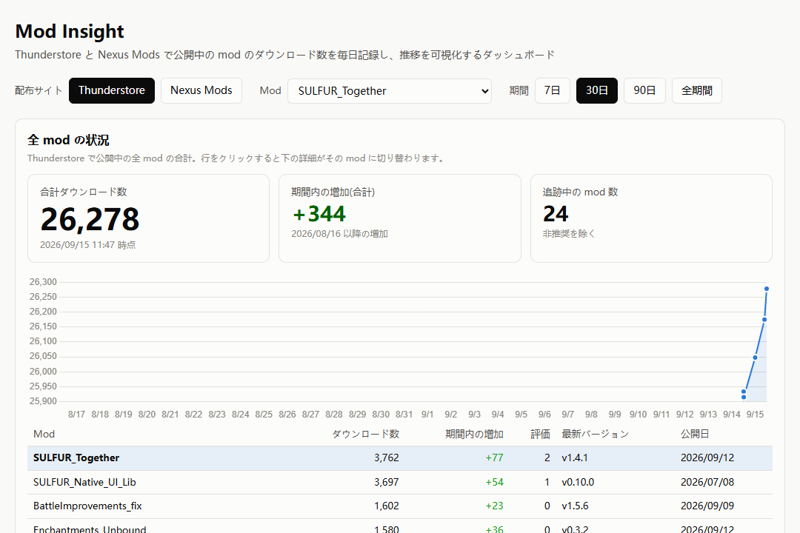
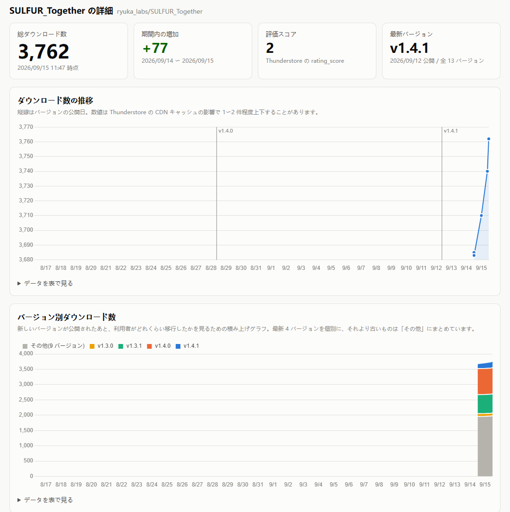
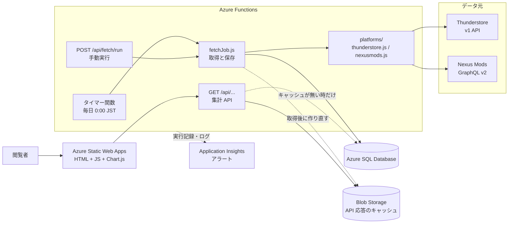

# Mod Insight

公開中の mod(ゲーム用の追加プログラム)のダウンロード数・評価・バージョンを **2 つの配布サイトから毎日自動で集め**、
履歴として保存し、増え方をグラフで分析できるようにしたデータ分析ダッシュボードです。

- ダッシュボード: **https://www.ryuka.cloud**
- 分析対象: 作者自身が Thunderstore と Nexus Mods で公開している mod(各 24 個、計 48 件)。実際の利用者がいる本物のデータです
- 構成: Azure Functions(取得ジョブ + REST API)/ Azure SQL Database / Azure Static Web Apps / Application Insights

配布サイトの API を「取得 → 時系列で保存 → 集計 API → 可視化」の流れに乗せる作りなので、
対象を EC サイトの商品や App Store のアプリなど、API で数値が取れる別の対象に置き換えても同じ構成で使えます。



---

## 目次

1. [このダッシュボードで分かること](#1-このダッシュボードで分かること)
2. [現在のデータ](#2-現在のデータ2026-09-15-時点)
3. [データの扱いで決めたこと](#3-データの扱いで決めたこと)
4. [システム構成](#4-システム構成)
5. [データベース](#5-データベース)
6. [REST API](#6-rest-api)
7. [監視](#7-監視)
8. [ディレクトリ構成](#8-ディレクトリ構成)
9. [ローカルでの実行とデプロイ](#9-ローカルでの実行とデプロイ)
10. [既知の制約と今後](#10-既知の制約と今後)

---

## 1. このダッシュボードで分かること

画面上部の「配布サイト」「Mod」「期間(7日 / 30日 / 90日 / 全期間)」で条件を選ぶと、下のすべての表示がその条件で集計されます。

| 知りたいこと | 画面のどこで見るか | どう集計しているか |
|---|---|---|
| 全体としてどれくらい使われているか | 「全 mod の状況」の合計ダウンロード数と合計推移グラフ | 取得回ごとに全 mod のダウンロード数を合計 |
| 毎日どれくらい増えているか、増え方は変わったか | 「日ごとの増加」の棒グラフと 7 日平均の線 | mod ごとに「当日の値 − 前日の値」を出して全 mod で合計(下の「データの扱い」参照) |
| 最近伸びているのはどの mod か | 一覧表の「期間内の増加」 | mod ごとに「最新の値 − 期間開始後で最初の値」 |
| アップデートがダウンロードを押し上げたか | mod 詳細の推移グラフ(縦線 = バージョン公開日) | 時系列の折れ線にバージョン公開日を重ねて表示 |
| 新しいバージョンに利用者がどれくらい移ったか | バージョン別ダウンロード数の積み上げグラフ | バージョンごとの時系列。最新 4 バージョンを個別、それより古いものは「その他」 |
| 配布サイトによって反応が違うか | 「配布サイト」の切り替え | 同じ mod を Thunderstore / Nexus Mods それぞれで集計 |



グラフの下の「データを表で見る」を開くと、グラフと同じ数値を表で確認できます。

## 2. 現在のデータ(2026-09-15 時点)

| 配布サイト | 追跡中の mod | 合計ダウンロード数 | 記録開始 |
|---|---:|---:|---|
| Thunderstore | 24 | 26,278 | 2026-09-14 |
| Nexus Mods | 24 | 5,801 | 2026-09-15 |
| 合計 | 48 | 32,079 | |

**分析の例: 新バージョンへの移行**

最もダウンロード数の多い `SULFUR_Together`(Thunderstore)の、2026-09-14 12:11 → 09-15 11:47(日本時間、約 24 時間)の増加は +77 でした。
バージョン別に見ると、そのうち **+46 が 3 日前に公開した最新版 v1.4.1**、残りは古い 12 バージョンに 2〜4 件ずつ分散しています。

| バージョン | 公開日 | 09-14 | 09-15 | 増加 |
|---|---|---:|---:|---:|
| v1.4.1 | 2026-09-12 | 163 | 209 | +46 |
| v1.4.0 | 2026-08-28 | 851 | 854 | +3 |
| v1.3.1 | 2026-08-03 | 622 | 624 | +2 |
| その他 10 バージョン | | 2,049 | 2,075 | +26 |
| 合計 | | 3,685 | 3,762 | +77 |

「新しいダウンロードの約 6 割は最新版に向かっているが、古いバージョンを指定して取る利用者も一定数いる」ことが読み取れます。
ただしこれは 1 日分の差なので、傾向として言えるようになるにはデータの蓄積が必要です(記録は毎日 1 回増えていきます)。

## 3. データの扱いで決めたこと

分析結果の信頼性に関わる部分なので、数値をどう作っているかを明記しておきます。

**総ダウンロード数の出し方が配布サイトで違う**
- Thunderstore の一覧 API には総ダウンロード数の項目がないため、`versions[].downloads`(バージョンごとの数)を合計して求めています。
  個別 mod 用の API(experimental)には総数の項目がありますが、実際に呼ぶと `-1` しか返らないため使っていません。
- Nexus Mods は API が返す mod 全体の `downloads` をそのまま使っています。ファイル単位の数を足した値とは 1〜2 件ずれることがあります。

**Nexus Mods は「ファイル」単位で数えている**
同じバージョン番号のファイルが複数ある(例: 旧版アーカイブと通常版)ことがあるため、バージョン番号でまとめてダウンロード数を合計し、
公開日はそのバージョンで最も古いファイルの日付を使っています。これで「1 mod の 1 バージョンは 1 行」という前提を両サイトで揃えています。

**評価の意味が配布サイトで違う**
Thunderstore の `rating_score` と Nexus Mods の `endorsements`(推薦数)は同じ列に保存していますが、意味が違うので
画面の見出しを配布サイトに合わせて「評価」「推薦数」と切り替えています。サイトをまたいで評価を比べる表示は作っていません。

**同じ回の取得には同じ時刻を入れる**
1 回の取得ジョブで保存するすべての行に同じ `captured_at` を入れています。
そのため「時刻でグループ化して合計する」だけで、配布サイトをまたいだ合計が取得回ごとに出せます(取得に数分かかっても時刻がばらけません)。

**日ごとの増加は「mod ごとの前日との差」を足して出す**
取得回ごとの合計の差を「増加」とすると、2 つの点で数字が狂います。
- 途中で mod が増えると(新しい mod の公開、配布サイトの追加)、その mod の既存のダウンロード数がそのまま段差になる。
  実際、Nexus Mods を追加した 2026-09-15 には両サイト合計で +5,904 の段差が出る(その日の本当の増加は 348)
- 手動で実行した日は 1 日に何回も取得しているので、回ごとの差が 1 日の増加にならない

そこで、mod ごとに 1 日 1 点(その日の最後の取得)にそろえ、前日にも記録がある mod だけ差を取って足しています(`api/src/dailyIncrease.js`)。
日の区切りは `captured_at` の UTC の日付です。定時取得は UTC 15:00 = 日本時間 0:00 なので、UTC の日付がそのまま「日本時間で何日の増加か」になります。
取得が失敗して抜けた日の翌日は、その日の差を出しません(2 日分を 1 日の増加として見せないため)。

**バージョン別の数は専用テーブルに毎回記録する**
`mod_versions` は 1 バージョン 1 行なので、そこに数を持たせると「最新の値」しか残りません。
移行の速さを見るには毎日の履歴が必要なので、`version_snapshots` テーブルに取得のたびに 1 行ずつ追加しています。
このテーブルを作る前のデータは、保存しておいた API 応答から埋め戻しました(`scripts/backfill-version-snapshots.js`)。

**API の応答を丸ごと保存する**
`snapshots.raw_json` に取得時の応答をそのまま残しています。あとから別の項目を分析したくなっても、表を変えずに過去分から取り出せます。
上の埋め戻しもこの保存データから行いました。

**小さな減少は補正しない**
Thunderstore のダウンロード数は配信側のキャッシュの影響で、数分違いの取得でも 1〜2 件上下することがあります(後の取得のほうが小さいこともある)。
これはデータ元の性質なので補正はせず、画面に注記を出しています。

**期間内の増加は「期間の中で最初に取った値」との差**
期間を 30 日にしても、記録を始めてから 30 日経っていなければ、記録開始時点との差になります。
集計は SQL の `ROW_NUMBER() OVER (PARTITION BY mod_id ORDER BY captured_at ...)` で mod ごとに最新 1 行と期間の最初の 1 行を選び、
全 mod 分を 1 回の問い合わせで返しています(`api/src/db.js` の `getOverview`)。

## 4. システム構成



**取得の流れ**
1. タイマー関数が毎日 15:00 UTC(日本時間 0:00)に起動する
2. 配布サイトごとのアダプター(`api/src/platforms/`)が API を呼び、応答を共通の形 `{ name, author, external_id, download_count, rating_score, raw_json, versions[] }` に直す
3. `api/src/fetchJob.js` がその形だけを見て DB に保存する(配布サイトの項目名は知らない)
4. 配布サイトごとに実行結果を `fetch_logs` に 1 行残す。1 つの mod で失敗しても他の mod の保存は続ける
5. 最後に `api/src/cache.js` が GET API の応答をすべて Blob Storage に書き直す(下記「読み取りの流れ」)

**読み取りの流れ**

GET API はまず Blob Storage のキャッシュを返し、キャッシュが無い時だけ DB に問い合わせます。
データは 1 日 1 回の取得ジョブでしか変わらないので、それ以外の時間に DB を使う理由がないためです。

- Azure SQL の無料枠(サーバーレス)は使われない時間が続くと自動で一時停止し、次の接続に約 50 秒かかります。以前はその日はじめて開いた人がこの 50 秒を待っていました(調査記録: [docs/ops-log.md](docs/ops-log.md))
- キャッシュは `{ run_at, generated_at, data }` の形で、`run_at`(取得ジョブの実行日時)が「どの回のデータか」を表します。応答ヘッダー `x-data-source`(`cache` / `db`)と `x-data-run-at` でどちらの経路で返したかが分かります
- 期間(`from` / `to`)や配布サイト(`platform`)の絞り込みは、全期間のキャッシュを読んだ後に JS 側で行います。期間ごとに Blob を分けるより単純で、取得ジョブはフロントエンドがどの期間を使うかを知らなくてよいためです
- キャッシュの書き込みに失敗しても取得ジョブの結果(`fetch_logs`)は変わらず、API は DB に戻るだけです

配布サイトを増やすときは、共通の形を返すアダプターを 1 ファイル追加するだけで、保存処理と API は変更しません。

| 役割 | 使っているもの | 選んだ理由 |
|---|---|---|
| 取得ジョブ・API | Azure Functions(Node.js、プログラミングモデル v4、Flex Consumption) | 1 日 1 回のジョブと少量の API にサーバーを常時動かす必要がない。Static Web Apps に付属する Functions はタイマー起動に対応していないため、独立した Function App にしている |
| データベース | Azure SQL Database(無料枠) | 「mod ↔ バージョン ↔ 時系列」の関係がはっきりしていて、集計を SQL の JOIN とウィンドウ関数で書けるため |
| 読み取りキャッシュ | Blob Storage(Function App と同じストレージアカウント) | 応答は 1 日 1 回しか変わらないので、JSON をそのまま置いておけばよい。DB を一時停止のままにでき、無料枠の消費も抑えられる |
| フロントエンド | 素の HTML / JavaScript + Chart.js、Azure Static Web Apps(無料枠) | 1 画面にグラフが数枚だけなので、ビルド工程が要らない構成にした |
| 監視 | Application Insights + Azure Monitor アラート | 関数の実行記録が自動で集まり、「ジョブが動かなかった」「失敗した」をメールで通知できる |
| 手動実行の保護 | Azure Functions の関数キー(`authLevel: "function"`) | キーの発行・無効化を Azure 側で管理でき、コードに秘密情報を持たなくてよい |
| バックエンドの自動配置 | GitHub Actions + OpenID Connect + ユーザー割り当てマネージド ID | GitHub にパスワードや発行プロファイルを置かずに済む。ID は main ブランチからの要求だけを受け付け、権限は Function App 1 つに限っている |

## 5. データベース

建表スクリプトは `sql/` にあり、番号順に 1 回ずつ実行します。

| テーブル | 1 行が表すもの | 主な列 |
|---|---|---|
| `mods` | 追跡している mod 1 件 | `platform` + `external_id` で一意(同じ名前の mod が別サイトにあっても区別できる)、`is_deprecated` |
| `mod_versions` | mod のバージョン 1 つ | `(mod_id, version_number)` で一意、`release_date` |
| `snapshots` | ある取得時点の mod 1 件の値 | `captured_at`、`download_count`、`rating_score`、`raw_json` |
| `version_snapshots` | ある取得時点のバージョン 1 つの値 | `version_id`、`captured_at`、`download_count` |
| `fetch_logs` | 取得ジョブ 1 回 × 配布サイト 1 つの結果 | `run_at`、`platform`、`status`、`records_fetched`、`error_message` |

| スクリプト | 内容 |
|---|---|
| `sql/001_create_tables.sql` | 基本の 4 テーブル |
| `sql/002_create_version_snapshots.sql` | `version_snapshots` と `mod_versions` の一意制約 |
| `sql/003_add_platform_to_fetch_logs.sql` | `fetch_logs.platform` |

## 6. REST API

ベース URL: `https://mod-insight-ryuka-hrhbbdauc0ezbfc7.eastasia-01.azurewebsites.net/api`

| メソッド | パス | 内容 |
|---|---|---|
| GET | `/mods` | 追跡中の mod 一覧 |
| GET | `/overview?from=&platform=` | 全 mod の最新値・期間内の増加・最新バージョン、取得回ごとの合計推移、日ごとの増加と 7 日平均(`daily`)。`platform` は `thunderstore` / `nexusmods`(省略時は両方の合計) |
| GET | `/mods/{modId}/summary` | 最新スナップショットのまとめ |
| GET | `/mods/{modId}/snapshots?from=&to=` | ダウンロード数の時系列 |
| GET | `/mods/{modId}/versions` | バージョン履歴 |
| GET | `/mods/{modId}/version-snapshots?from=&to=` | バージョンごとのダウンロード数の時系列 |
| GET | `/fetch/logs` | 取得ジョブの実行記録 |
| POST | `/fetch/run` | 取得ジョブを今すぐ 1 回実行(ヘッダー `x-functions-key` が必要) |

GET はすべて認証なし(公開データの読み取りのみ)。エラーは `{ "error": "説明" }` の形で、
400 = パラメータ不正、404 = mod が存在しない、500 = データベースエラー です。

```
$ curl "https://mod-insight-ryuka-hrhbbdauc0ezbfc7.eastasia-01.azurewebsites.net/api/fetch/logs"
[{"log_id":6,"run_at":"2026-09-15T02:47:21.798Z","platform":"nexusmods","status":"success","error_message":null,"records_fetched":24}, ...]
```

## 7. 監視

Application Insights に関数の実行記録とログが自動で集まります。次の 5 つのアラートをメール通知で設定しています。

| アラート | 条件 |
|---|---|
| `alert-fetch-job-missing` | 直近 48 時間に定時の取得ジョブが 1 回も成功していない |
| `alert-fetch-job-failed` | 取得ジョブの終了ログに `status=failed` がある(API 取得や DB 保存に失敗した回) |
| `alert-api-failures` | 5 分間に失敗した HTTP リクエストが 5 件を超える |
| `alert-cache-update-failed` | 取得ジョブが DB には保存できたのに Blob キャッシュの作り直しに失敗した |
| `alert-sql-free-limit-low` | Azure SQL の無料枠の残りが 20,000 vCore 秒(20%)を下回った(使い切るとその月の残りは DB が止まる) |

確認用のクエリ(KQL)と設定の詳細は [docs/monitoring.md](docs/monitoring.md) にまとめています。

本番で起きた問題の調査記録(現象・調査手順・根因・決定)は [docs/ops-log.md](docs/ops-log.md) に残しています。

## 8. ディレクトリ構成

```
Mod-Insight/
  api/                         Azure Functions プロジェクト
    src/functions/             関数 1 つにつき 1 ファイル(HTTP API 8 本 + タイマー 1 本)
    src/platforms/             配布サイトごとのアダプター(API の応答 → 共通の形)
    src/fetchJob.js            取得ジョブ本体(タイマーと手動実行の両方から呼ぶ)
    src/cache.js               GET API 応答の Blob Storage キャッシュ(読み・作り直し)
    src/db.js                  SQL をすべてここに集約
    src/httpUtil.js            パラメータの解釈とエラー応答の形
  web/                         ダッシュボード(index.html / app.js / style.css / config.js)
  sql/                         建表スクリプト(番号順に実行)
  scripts/                     単体で動かす補助スクリプト(API の確認、データの埋め戻し)
  docs/                        監視の説明、運用記録、README 用の画像
  api/test/                    ユニットテスト(node:test)
  .github/workflows/           テスト実行、api/ の Azure Functions への配置、web/ の Static Web Apps への配置
```

## 9. ローカルでの実行とデプロイ

### 必要なもの

- Node.js 24(Azure 上の Function App と同じバージョン)
- Azure Functions Core Tools v4(`npm i -g azure-functions-core-tools@4`)
- Azure CLI(デプロイする場合)
- Azure SQL Database(`sql/` のスクリプトを番号順に実行しておく)

### バックエンド

`api/local.settings.json` を作成します(Git には含めません)。

```json
{
  "IsEncrypted": false,
  "Values": {
    "FUNCTIONS_WORKER_RUNTIME": "node",
    "AzureWebJobsStorage": "",
    "AZURE_SQL_CONNECTION_STRING": "<Azure SQL の接続文字列>",
    "CACHE_STORAGE_CONNECTION_STRING": "<Blob Storage の接続文字列(省略可)>"
  }
}
```

`CACHE_STORAGE_CONNECTION_STRING` を省略するとキャッシュを使わず、GET API は毎回 DB に問い合わせます。
`AzureWebJobsStorage` と同じアカウントを指してかまいませんが、設定名を分けているのは、ローカルから本物のストレージを使ってもタイマーの状態ファイルを共有しないためです。

```
cd api
npm install
func start
```

`http://localhost:7071/api/...` で API が動きます。
HTTP 関数はストレージなしで動きますが、タイマー関数を動かすには `AzureWebJobsStorage` にストレージ(Azurite など)が必要です。
取得ジョブだけを試す場合は `POST http://localhost:7071/api/fetch/run` を呼びます(ローカルではキー不要)。

### テスト

```
cd api
npm test
```

Node.js 標準の `node:test` を使っているので追加のパッケージは要りません。DB にも外部 API にもつながず、
パラメータの解釈(`httpUtil.js`)、キャッシュの絞り込み(`cache.js`)、配布サイトの応答を共通の形に直す処理
(`platforms/`、`fetch` を差し替えて固定の JSON を与える)を確かめます。
Pull Request と `main` への push では GitHub Actions(`.github/workflows/test.yml`)が同じテストを実行します。

データ元の API の応答だけを確認したいときは、DB なしで次のスクリプトを実行できます。

```
node scripts/test-thunderstore-api.js
node scripts/test-nexusmods-api.js
```

### フロントエンド

`web/config.js` の `apiBaseUrl` を `http://localhost:7071/api` に変更し、`web/` を静的サーバーで配信します。

```
npx http-server web -p 8080
```

(Function App 側の CORS はポート 8080 と 5500 を許可しています。)

### デプロイ

- **フロントエンド**: `main` ブランチに `web/` の変更を push すると、GitHub Actions(`.github/workflows/deploy-web.yml`)が Static Web Apps に配置します。
  リポジトリの Secrets に `AZURE_STATIC_WEB_APPS_API_TOKEN`(Static Web Apps のデプロイトークン)の登録が必要です。
- **バックエンド**: `main` ブランチに `api/` の変更を push すると、GitHub Actions(`.github/workflows/deploy-api.yml`)が
  テスト → zip 作成 → Function App への配置 → `GET /api/overview` の動作確認 を行います。テストが失敗した場合は配置しません。

バックエンドの配置では、Azure へのログインに OpenID Connect を使っています。GitHub が実行のたびに発行する短時間だけ有効なトークンを、
Azure のユーザー割り当てマネージド ID と交換してログインするので、GitHub にパスワードや発行プロファイルを置いていません。
Azure 側の準備(1 回だけ):

```
az identity create -g <リソースグループ> -n <ID 名>
az identity federated-credential create -g <リソースグループ> --identity-name <ID 名> -n github-main \
  --issuer https://token.actions.githubusercontent.com \
  --subject repo:<ユーザー名>@<所有者 ID>/<リポジトリ名>@<リポジトリ ID>:ref:refs/heads/main \
  --audiences api://AzureADTokenExchange
az role assignment create --assignee-object-id <ID の principalId> --assignee-principal-type ServicePrincipal \
  --role "Website Contributor" --scope <Function App のリソース ID>
```

`--subject` は GitHub が発行するトークンの subject と完全に一致している必要があります。このリポジトリでは、所有者とリポジトリの
数値 ID を含む形式(例: `repo:ryuka-dev@64645371/Mod-Insight@1370703702:ref:refs/heads/main`)で発行されます。
ID を含むので、リポジトリを消して同じ名前で作り直した別物からはログインできません。
数値 ID は `gh api repos/<ユーザー名>/<リポジトリ名> --jq '"\(.owner.id) \(.id)"'` で確認できます。
一致しない場合、ワークフローの「Azure にログイン」のログに実際の subject と `AADSTS700213` が出るので、その値に合わせます。

リポジトリの Secrets には `AZURE_CLIENT_ID`(ID の clientId)、`AZURE_TENANT_ID`、`AZURE_SUBSCRIPTION_ID` を登録します。
どれも「どの ID か」を示す番号で、これだけではログインできません。

手元から配置する場合は、`api/` の `host.json`、`package.json`、`package-lock.json`、`src/` を zip にまとめ、リモートビルドで配置します
(ワークフローも同じコマンドを使っています)。

```
az functionapp deployment source config-zip -g <リソースグループ> -n <Function App 名> --src api.zip --build-remote true
```

Function App のアプリケーション設定に `AZURE_SQL_CONNECTION_STRING` と `CACHE_STORAGE_CONNECTION_STRING` を登録しておきます。
Windows の `Compress-Archive` で作った zip はパス区切りが `\` になり Linux 上で展開できないため、`/` 区切りで zip を作ってください。

## 10. 既知の制約と今後

- **データの蓄積期間が短い**: 記録は Thunderstore が 2026-09-14、Nexus Mods が 2026-09-15 から。7 日・30 日の比較が意味を持つのはこれからです。
- **取得は 1 日 1 回**: 1 日の中での変化(時間帯ごとの増え方など)は分かりません。
- **データ元の揺らぎ**: 上に書いたとおり、Thunderstore の数値は 1〜2 件上下することがあります。
- **外部呼び出しの所要時間は記録していない**: SQL や配布サイト API への呼び出しは Application Insights の依存関係として記録されていません(関数全体の所要時間で見ています)。
- **自動テストとバックエンドの CI は未整備**: パラメータの解釈やアダプターの変換処理から単体テストを追加する予定です。
